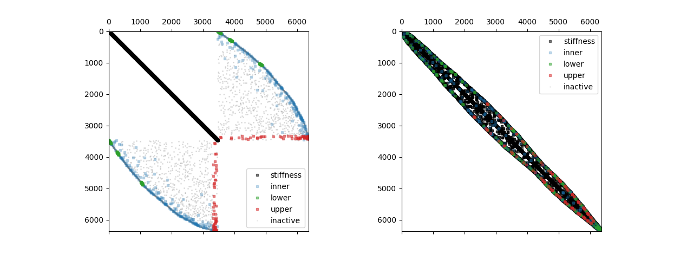

🔧 Model
========

Models are stored in the directory `fibermat.model`.

Degrees of Freedom
~~~~~~~~~~~~~~~~~~

.. autofunction:: fibermat.model.timoshenko.displacement
.. autofunction:: fibermat.model.timoshenko.rotation
.. autofunction:: fibermat.model.timoshenko.force
.. autofunction:: fibermat.model.timoshenko.torque

Mechanical model
~~~~~~~~~~~~~~~~

stiffness
---------

.. autofunction:: fibermat.model.timoshenko.stiffness

constraint
----------

.. autofunction:: fibermat.model.timoshenko.constraint

Example
~~~~~~~

.. code-block:: python

    from fibermat import *

    # Generate a set of fibers
    mat = Mat(100)
    # Build the fiber network
    net = Net(mat)
    # Stack fibers
    stack = Stack(net)
    # Create the fiber mesh
    mesh = Mesh(stack)

    # Assemble the quadratic programming system
    K, u, F, du, dF = stiffness(mesh)
    C, f, H, df, dH = constraint(mesh)
    P = sp.sparse.bmat([[K, C.T], [C, None]], format='csc')
    # Permutation of indices
    perm = sp.sparse.csgraph.reverse_cuthill_mckee(P, symmetric_mode=True)
    # Visualize the system
    fig, ax = plt.subplots(1, 2, figsize=(2 * 6.4, 4.8))
    plot_system((K, u, F, du, dF), (C, f, H, df, dH), perm=None, ax=ax[0])
    plot_system((K, u, F, du, dF), (C, f, H, df, dH), perm=perm, ax=ax[1])
    plt.show()

